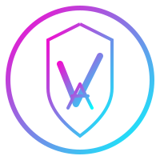
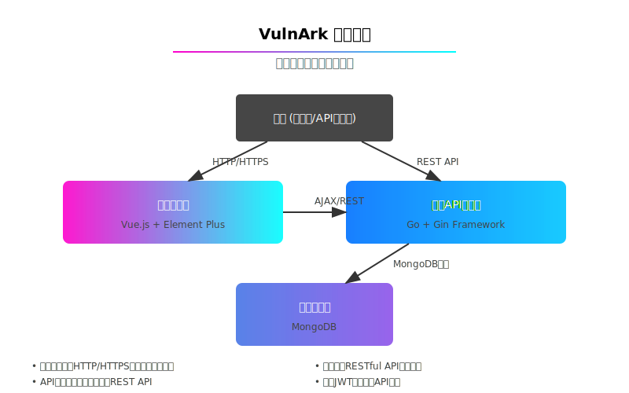

# VulnArk - 安全漏洞管理平台

<div align="center">
  
  <p>安全漏洞全生命周期管理系统，集成报告生成与数据分析功能</p>
</div>

[](https://hub.docker.com/r/username/vulnark)
[](https://github.com/MochizukiSec/VulnArk/blob/main/LICENSE)

## 📖 概述

VulnArk是一个现代化的漏洞管理平台，帮助安全团队高效管理漏洞的全生命周期。系统支持漏洞的记录、跟踪、优先级管理、报告生成和数据分析，提供直观的用户界面和全面的API支持。

> **注意**: 此仓库仅包含Docker配置文件，不包含源代码。这是为了方便用户通过Docker快速部署应用，同时保护项目的核心知识产权。

## ✨ 核心功能

- **漏洞管理**: 全面管理系统安全漏洞，基于CVSS评分评估风险
- **仪表盘分析**: 直观的安全数据可视化，帮助快速识别安全趋势
- **安全报告**: 支持多种报告类型和格式，包括PDF、Excel、Word和HTML
- **用户与权限**: 完善的用户管理和基于角色的权限控制系统
- **系统集成**: 灵活的API设计，便于与其他安全工具集成
- **安全与合规**: 内置的安全机制，确保系统合规和安全

## 🚀 快速开始

### 前提条件

- [Docker](https://docs.docker.com/get-docker/) 和 [Docker Compose](https://docs.docker.com/compose/install/)
- 至少4GB内存和2核CPU
- 20GB可用磁盘空间
- 良好的网络连接（用于拉取Docker镜像）

### 使用Docker部署

#### 方法一：使用打包的配置文件

本仓库提供了一个打包的配置文件 `vulnark-docker.tar.gz`，您可以下载并解压后使用：

1. 下载配置文件包
   ```bash
   wget https://github.com/MochizukiSec/VulnArk/raw/main/vulnark-docker.tar.gz
   ```

2. 解压配置文件
   ```bash
   tar -xzf vulnark-docker.tar.gz
   ```

3. 启动服务
   ```bash
   docker-compose up -d
   ```

#### 方法二：直接使用仓库中的配置文件

1. 克隆仓库
   ```bash
   git clone https://github.com/MochizukiSec/VulnArk.git
   cd VulnArk
   ```

2. 启动服务
   ```bash
   docker-compose up -d
   ```

3. 访问应用
   ```
   前端: http://localhost:8080
   API: http://localhost:8000
   ```

4. 默认管理员账号
   ```
   用户名: admin@vulnark.com
   密码: Admin@123
   ```

## 🔧 配置选项

VulnArk提供多种配置选项，可通过环境变量或修改docker-compose.yml文件进行设置。

### 环境变量

| 环境变量 | 说明 | 默认值 |
|----------|------|---------|
| PORT | API服务端口 | 8000 |
| MONGO_URI | MongoDB连接URI | mongodb://mongodb:27017 |
| MONGO_DB_NAME | MongoDB数据库名称 | vulnark_db |
| JWT_SECRET | JWT密钥 | your-secret-key-for-production |
| ALLOWED_ORIGINS | CORS允许的源 | http://localhost:8080 |
| LOG_LEVEL | 日志级别 | info |

### 自定义配置示例

您可以创建一个 `docker-compose.override.yml` 文件来覆盖默认配置：

```yaml
# docker-compose.override.yml
version: '3.8'

services:
  backend:
    environment:
      - PORT=9000
      - JWT_SECRET=my-custom-secret
      - LOG_LEVEL=debug
    ports:
      - "9000:9000"
  
  frontend:
    ports:
      - "3000:80"
```

## 📊 系统架构

VulnArk采用现代化的微服务架构，分为前端、后端API和数据库三层：



- **前端**: Vue.js + Element Plus构建的SPA应用
- **后端API**: Go语言开发的RESTful API
- **数据库**: MongoDB提供的文档存储

## 🔒 系统安全

VulnArk内置了多层安全机制：

- JWT基于角色的身份认证
- API请求速率限制
- 数据输入验证和清洗
- 密码加密存储
- 审计日志记录

## 📋 系统要求

### 最低配置
- 2核CPU
- 4GB内存
- 20GB磁盘空间

### 推荐配置
- 4核CPU
- 8GB内存
- 50GB SSD磁盘空间

## 🛠 常见问题

### 如何更新到最新版本？

```bash
# 拉取最新的Docker镜像
docker-compose pull

# 重启服务
docker-compose down
docker-compose up -d
```

### 数据备份与恢复

备份MongoDB数据：

```bash
docker exec -it vulnark_mongodb mongodump --out /backup/$(date +%Y%m%d)
```

恢复MongoDB数据：

```bash
docker exec -it vulnark_mongodb mongorestore /backup/20230101
```

## 🤝 贡献指南

我们欢迎社区贡献，请参阅[贡献指南](CONTRIBUTING.md)了解如何参与项目开发。

## 📜 许可证

本项目采用MIT许可证 - 详见[LICENSE](LICENSE)文件 